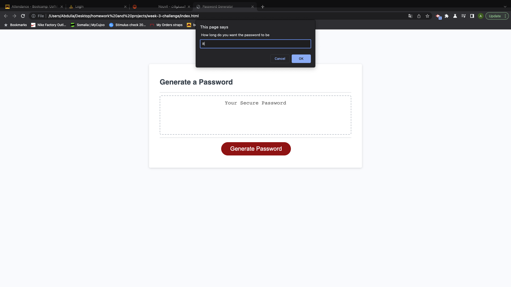
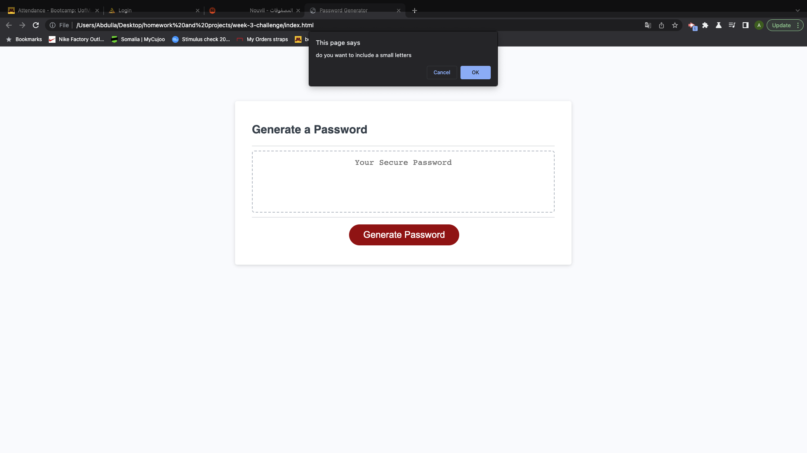
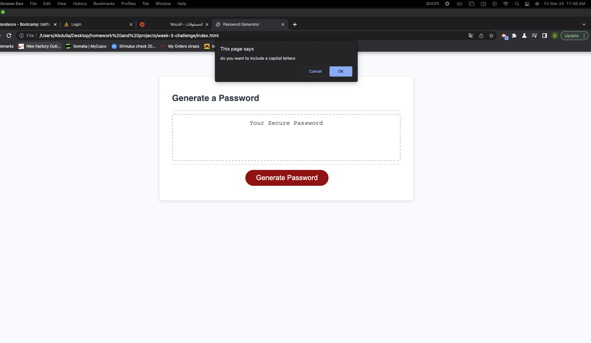
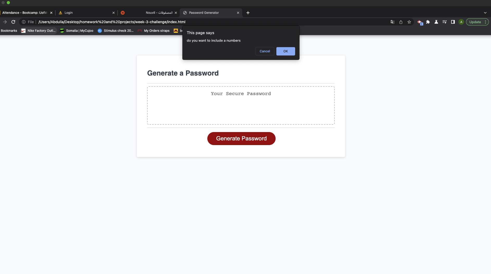
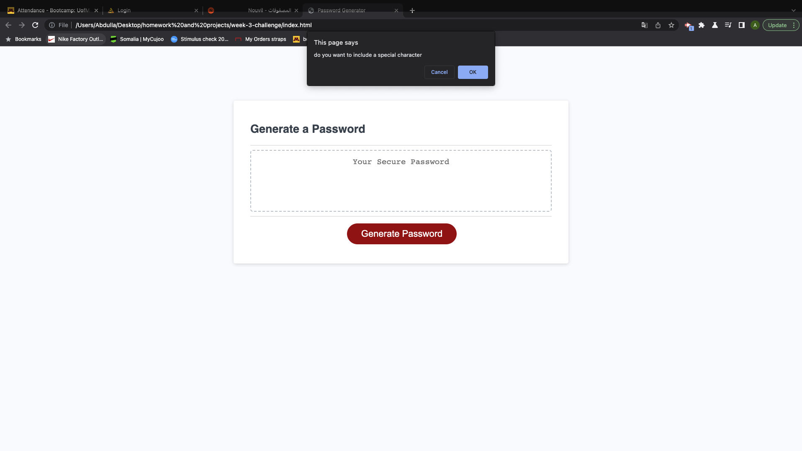
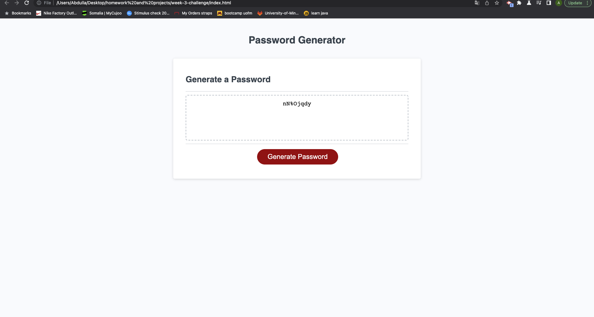

# week-3-challenge
# Password Generator

# User Story
AS A Developer
I WANT to randomly generate a password that meets the clients criteria
SO THAT I can create a strong password that provides greater security for them

# The Acceptance Criteria 

ITS DONE
    when I have a button that generate a password
ITS Done 
    when I click that button it pops up a prompts shows and asks about the length of the password
ITS Done 
    when i set the password length to be between 8 to 128.
ITS Done
    when I enter three confirmations of what would the password contain 
ITS Done
    when asked for what to include in the password
ITS Done 
    when I set the confirms to include lowercase, uppercase, numeric, and/or special characters
ITS Done 
    when the user choses all the options they need it generates a password that fits their choice. 

# Images 

# Live URL 

https://aiahmed01.github.io/week-3-challenge/

# Github Link
https://github.com/Aiahmed01/week-3-challenge
